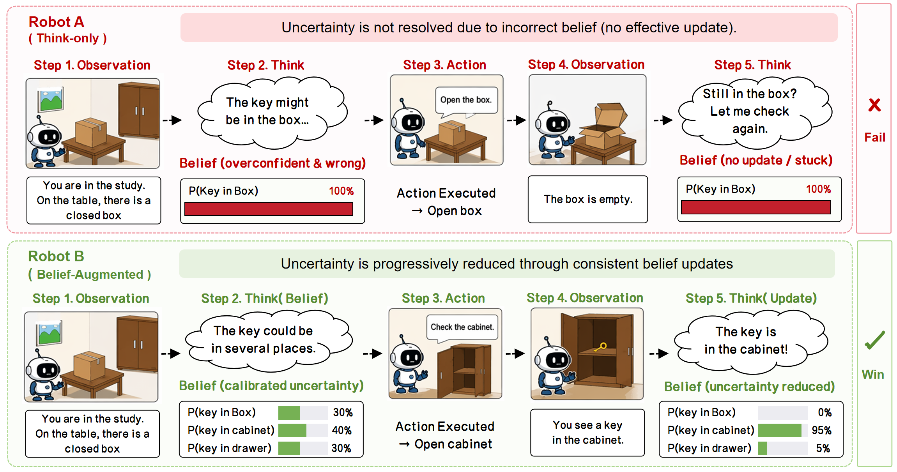
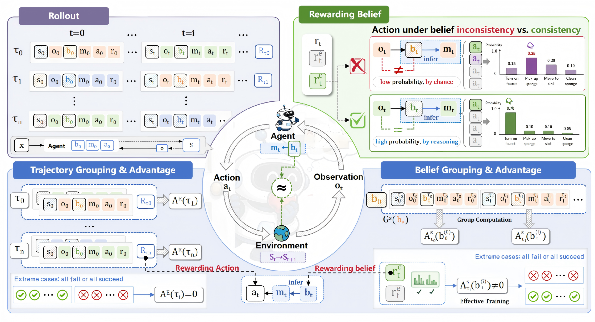

<div align="center">

<h1>
  <span style="color: rgb(0, 176, 240);">Re</span><span style="color: rgb(250, 196, 34);">B</span><span style="color: rgb(0, 176, 80);">el</span>: Rewarding <span style="color: rgb(0, 176, 240);">Be</span>liefs, Not Actions
</h1>
<h3>Consistency-Guided Credit Assignment for Long-Horizon Agents</h3>

</div>

<p align="center">
  📄 <a href="https://arxiv.org/abs/2605.20061" target="_blank">Paper</a> • 🌐 <a href="https://fateyetian.github.io/Rebel/" target="_blank">Project Page</a> • 💻 <a href="https://github.com/Fateyetian/Rebel" target="_blank">Code</a><br>
</p>

<p align="center">
  <i>"Long-horizon decision making is not won by faster actions, but by truer beliefs — credit must flow to what the agent <b>knows</b>, not merely to what it <b>does</b>."</i>
</p>


<p align="center">
  
  
  
  
  
</p>

**TL;DR** — On **ALFWorld**, ReBel reaches **SOTA performance (93.2% SR)** on a **Qwen2.5-1.5B** backbone with only **100 training epochs**. Belief-aware self-supervision explicitly models what the agent *knows*, turning belief inconsistencies into dense learning signals and making credit assignment robust to partial observability.

## 📖 Introduction

**ReBel** is a belief-structured reinforcement learning framework for LLM agents in partially observable, long-horizon environments. Standard RL fine-tuning encodes belief implicitly in hidden states, which makes belief drift invisible to credit assignment and forces sparse terminal rewards to traverse 30+ steps of mixed-quality reasoning. ReBel attacks both problems by:

1. **Externalizing belief** as a structured `<belief>` segment, decomposing the policy into a `belief → think → action` factorization that is independently supervised.
2. **Belief-Consistency Reward** — a dense step-wise signal that verifies each predicted predicate against subsequent observations (with observability masking and a pending buffer for delayed verification).
3. **Belief-Anchor Step Advantage** — replaces observation-hash grouping with belief-equivalence-class grouping, eliminating the singleton-group failure mode that cripples step-level GRPO variants in POMDPs.

ReBel reaches **93.2 % SR on ALFWorld** and **75.1 % SR on WebShop** with a 1.5 B backbone, surpassing the strongest GRPO baseline by **+20.4 / +18.3 pp** while attaining **2.1× sample efficiency**.

<p align="center">
  
</p>
<p align="center"><em>Belief inconsistency (left) vs. ReBel's consistent belief tracking (right). The agent's internal belief must stay synchronized with observations to enable valid, goal-directed actions.</em></p>

## 🌟 Highlights

- **Solves belief drift in POMDPs.** Treats belief as a first-class, supervisable variable, allowing dense intermediate feedback rather than opaque end-of-episode credit.
- **Stable step-level credit assignment.** Belief-equivalence grouping yields semantically homogeneous classes even when physical states never repeat, fixing the singleton-group pathology of state-hash grouping (e.g. GiGPO).
- **Drop-in compatible with veRL-agent.** ReBel ships as a standard trainer (`examples/rebel_trainer/`) alongside `grpo_trainer/` and `gigpo_trainer/`, sharing the same multi-turn rollout and reward-manager infrastructure.
- **Strongest 1.5 B agent on ALFWorld & WebShop.** Outperforms Gemini-2.5-Pro on hardest ALFWorld task `Pick2` by +36.2 pp and shortens average episode length 29.9 → 9.2 steps.

## 🏆 Main Results

<div align="center">

| Benchmark    | Backbone           | **ReBel**         | GRPO       | GiGPO      | Δ vs GRPO | Δ vs GiGPO | Sample Eff. |
|:-------------|:-------------------|:-----------------:|:----------:|:----------:|:---------:|:----------:|:-----------:|
| **ALFWorld** | Qwen2.5-1.5B-Inst. | **93.2 ± 4.1 %**  | 72.8 ± 3.6 | 86.1 ± 2.4 | **+20.4** | **+7.1**   | **2.1×**    |
| **WebShop**  | Qwen2.5-1.5B-Inst. | **75.1 ± 2.7 %**  | 56.8 ± 3.8 | 67.4 ± 2.3 | **+18.3** | **+7.7**   | —           |

</div>

> 📈 Training efficiency: ReBel reaches GRPO's 100-iter terminal SR after only ~45 iters.
> 🎯 Hardest task: ALFWorld `Pick2` SR = **96.5 %** (+17.0 pp over best GiGPO variant).
> 📉 Avg. episode length on ALFWorld: 29.9 → **9.2 steps** (3.2× shorter).

## 🧩 Method Overview

ReBel decomposes the policy into a **`belief → think → action`** factorization with two core mechanisms:

- **Belief-Consistency Reward** (`r_cons`): dense step-wise signal verifying each predicted predicate against subsequent observations, with observability masking and a pending buffer for delayed verification.
- **Belief-Anchor Step Advantage** (`A_step`): replaces observation-hash grouping with belief-equivalence-class grouping, eliminating the singleton-group failure mode in POMDPs. Total advantage: `A_total = A_episode + ω · A_step` (ω = 0.5).

<p align="center">
  
</p>
<p align="center"><em><b>Main results.</b> (a) ALFWorld convergence — ReBel reaches GRPO's final SR by iteration 35 (2.1× sample efficiency). (b) Per-task success rates; Δ = gain over GRPO. (c) ReBel's gain vs. trajectory length, confirming that belief-tracking value scales with partial-observability depth.</em></p>

## 🚀 Quick Start

### Step 1: Prerequisites

- **OS**: Linux (or WSL2 on Windows)
- **Python**: 3.12 (main env), 3.10 (WebShop env)
- **GPU**: 4 × A800 (80 GB) recommended
- **Storage**: ~50 GB for models, datasets, and checkpoints

### Step 2: Install ReBel main environment

```shell
conda create -n rebel python=3.12 -y
conda activate rebel

pip install vllm==0.11.0
pip install flash-attn==2.7.4.post1 --no-build-isolation --no-cache-dir
pip install -e .
```

### Step 3: Install Environments

#### 👉 ALFWorld

```shell
pip install gymnasium==0.29.1 stable-baselines3==2.6.0 alfworld
alfworld-download -f
```

#### 👉 WebShop (separate env, Python ≤ 3.10)

```shell
conda create -n rebel-webshop python=3.10 -y
conda activate rebel-webshop
cd agent_system/environments/env_package/webshop/webshop && ./setup.sh -d all && cd -

pip install torch==2.6.0 --index-url https://download.pytorch.org/whl/cu124
pip install flash-attn==2.7.4.post1 --no-build-isolation
pip install -e .
pip install vllm==0.8.2
```

### Step 4: Configure SFT cold-start 

ReBel's SFT cold-start uses an LLM API to annotate raw expert trajectories with structured `<belief>/<think>/<action>` format segments, enabling the policy to learn the output format before RL training.

```shell
export TEACHER_API_KEY=<your-api-key>
export TEACHER_API_BASE=https://api.openai.com/v1   # or compatible endpoint
export TEACHER_MODEL=gpt-4o                          # any capable instruct model
```

### Step 5: Reproduce Main Results

#### 5.1 SFT Cold-Start (3 epoch, ~1h on 4 × A800)

```shell
bash scripts/sft_alfworld.sh    # ALFWorld
bash scripts/sft_webshop.sh     # WebShop
```

Produces: `checkpoints/sft/{alfworld,webshop}/qwen1.5b_rebel_sft/global_step_*`

#### 5.2 RL Training

| Final method | ALFWorld | WebShop | Iters |
|:-------------|:---------|:--------|:-----:|
| **ReBel (final)** ⭐ | `examples/rebel_trainer/run_alfworld.sh` | `examples/rebel_trainer/run_webshop.sh` | 100 |

```shell
# Single seed
bash scripts/rl_alfworld.sh
bash scripts/rl_webshop.sh

# Multi-seed (paper uses 3 seeds: 42 / 123 / 456)
SEED=42  bash scripts/rl_alfworld.sh
SEED=123 bash scripts/rl_alfworld.sh
SEED=456 bash scripts/rl_alfworld.sh
```

## 🗂️ Result Structure

After training, results are organized as follows:

```
results/{alfworld,webshop}/v11/{exp_name}_seed{N}/
├── train.log                  # full training log
├── eval_results.json          # per-iter eval SR / belief-acc / avg_len
├── checkpoints/
│   └── global_step_*/         # policy weights at each save interval
└── trajectories/
    └── iter_*/
        ├── rollout_*.jsonl    # full belief-think-action trajectories
        └── reward_breakdown.csv
```

A SwanLab project (configurable via `SWANLAB_API_KEY`) provides web-based curve tracking.

## 🔮 Future Work

ReBel demonstrates that *credit should flow to what the agent **knows**, not merely what it **does*** — a principle we believe opens a new research frontier for partially observable sequential decision-making. Below we sketch four directions that naturally extend this work.

1. **A new paradigm for credit assignment under partial observability.**  
   Standard RL treats the value function as a black box over hidden states. ReBel shows that *externalized, verifiable belief* can carry the credit signal directly, bypassing the need for the value function to reconstruct latent state from scratch. This suggests a broader architectural shift: whenever a task involves irreducible partial observability, belief-structured credit assignment may be the right primitive — not an add-on but the foundation.
2. **LLMs as nascent world models.**  
   The `belief → think → action` factorization in ReBel is a minimal instantiation of a world-model loop: the agent maintains a compressed, structured representation of the world, reasons over it, then acts. At scale, this loop could grow into a genuine predictive model — one that anticipates future observations, detects causal structure, and plans over imagined trajectories. ReBel is thus a small but concrete step toward LLMs that function as *world models* rather than reactive token predictors.
3. **Implications for future model architecture.**  
   ReBel's results suggest that the standard single-stream generation paradigm (tokens in → tokens out) may be suboptimal for agentic tasks. Explicitly separating the belief stream from the action stream makes the internal state inspectable, supervisable, and correctable — properties that are hard to achieve with monolithic hidden states. Future architectures might dedicate distinct modules or attention heads to belief maintenance, enabling richer credit assignment and more robust long-horizon reasoning without relying on ever-larger context windows.
4. **Cross-environment belief transfer and self-curated schemas.**  
   The predicate vocabulary in ReBel is currently hand-designed per environment. Two natural next steps: (a) *transfer* — test whether belief representations learned in one POMDP (e.g., ALFWorld) generalize to novel embodied tasks without re-engineering the predicate set; (b) *self-curation* — replace human-designed predicates with model-discovered abstractions, making the belief schema an emergent property of training rather than an engineering artifact.

## 📄 License

This codebase is licensed under the [Apache License 2.0](LICENSE). It builds on the following components, each retaining their original licenses:

- **veRL / verl-agent**: [Apache 2.0](https://www.apache.org/licenses/LICENSE-2.0)
- **ALFWorld**: [MIT License](https://opensource.org/licenses/MIT)
- **WebShop**: [MIT License](https://opensource.org/licenses/MIT)
- **GiGPO**: [Apache 2.0](https://www.apache.org/licenses/LICENSE-2.0)

## 🤝 Acknowledgement

ReBel is built on top of [veRL](https://github.com/volcengine/verl) and [verl-agent](https://github.com/langfengQ/verl-agent), with environments adapted from [ALFWorld](https://github.com/alfworld/alfworld) and [WebShop](https://github.com/princeton-nlp/WebShop). We thank the authors and maintainers of these projects for their excellent open-source work.

## 📧 Contact

For questions and discussions, please open an issue or contact the authors via the paper.

## 📚 Citation

```bibtex
@article{tang2026rebel,
  title   = {Rewarding Beliefs, Not Actions: Consistency-Guided Credit Assignment for Long-Horizon Agents},
  author  = {Wenjie Tang and Minne Li and Shijia Huang and others},
  journal = {arXiv preprint arXiv:2605.20061},
  year    = {2026},
  url     = {https://arxiv.org/abs/2605.20061}
}
```
